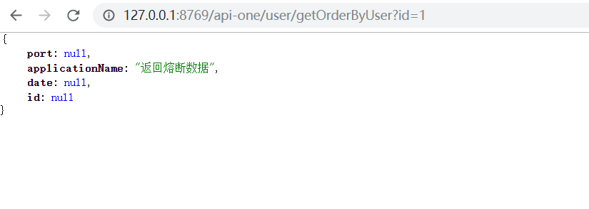

# enterprise-cloud
整合企业级微服务必要的组件和统一代码结构规范

## 项目模块
1. 服务的注册与发现(eureka)
2. 动态路由网关(zuul)
3. 负载均衡、远程调用、熔断器(ribbon、feign、hystrix)Feign默认是整合了Ribbon和Hystrix这两个框架
4. 服务链路追踪(Sleuth、Zipkin)
5. 断路器监控

## 部署说明 ##
先启动注册中心eureka,其他服务启动没有先后顺序  
通过maven 命令执行mvn clean package  
通过java -jar 启动每个模块的jar文件

## 代码分层说明
~~~
├─common
├─controller
│  └─remote
├─dao
├─dto
├─entity
├─service
│  ├─hystric
│  └─remote
│  └─impl
├─util
│─vo
└─config
~~~
#### common ####
存放公共的类，比如公共常量类，枚举类 
#### dao ####
存放数据库操作类，比如mybatis框架的maper类
#### dto ####
全称是Data Transfer Object, 用于**微服务**传输对象
#### vo ####
全称是value object,业务代码开发中用到，区别于dto的是，dto只能用于微服务层
#### entity ####
存放表映射到类的目录，可以理解就是持久化对象
#### controller ####
存放http接口  
#### controller.remote ####
存放**微服务**对外提供的接口方法
#### config ####
存放spirng框架的配置对象，比如druidConfig,redidConfig类
#### service ####
存放普通的业务逻辑类，比如userService类，如果需要用到interface接口文件，也是存放这个路径下
#### service.impl ####
存放service目录interface的实现类，文件命名以Impl作为后缀
#### service.remote ####
存放微服务调用的interface,里面的接口以I作为前缀，如下模板
~~~
@FeignClient(value = "SERVICE-TWO", fallback = OrderServiceHystric.class)
public interface IOrderService {

    @GetMapping(value = "remote/order/getOrderByUser")
    GetOrderByUserDto getOrderByUser(@RequestParam(value = "id") String id);

}
~~~
#### service.hystric ####
存放微服务熔断类，类文件以Hystric作为后缀，如下模板
~~~
@Component
public class OrderServiceHystric implements IOrderService {

    /**
     * 熔断，返回自定义的数据对象
     * @param id
     * @return
     */
    @Override
    public GetOrderByUserDto getOrderByUser(String id) {
        GetOrderByUserDto UserDto = new GetOrderByUserDto();
        UserDto.setApplicationName("null");
        return UserDto;
    }
}
~~~

## 服务演示 ##

#### 通过网关访问服务 ####

1. 请求http://127.0.0.1:8769/api-one/user/getOrderByUser?id=1  
8769是网关的端口，api-one是路由前缀,配置文件指定了api-one路由到service-one服务  
getOrderByUser里面的iOrderService实现类请求了service-two提供的远程接口   
整个流程跑下来，完成了注册中心注册和发现、网关路由、不同服务之间通信的过程   

2. 请求http://127.0.0.1:8769/api-two/order/listUserByOrder?orderId=22   
流程是上面类似，这次是service-two调用service-one对外提供的服务

#### 使用链路跟踪 ####
1. 请求http://127.0.0.1:8770/zipkin/ 出现如下图  

#### 容错保护 ####
###### 1.feign启用Hystrix(降级) ######  
微服务容错保护的是服务消费方,消费者自己定义一个fallback,避免服务提供方故障导致消费者请求线程等待或占用  
演示过程中，不启动service-two,启动eureka,zuul,service-one,调用service-one的远程调用，
此时service-two作为服务提供方没有可用服务，因此触发service-one的熔断机制。  
请求http://127.0.0.1:8769/api-one/user/getOrderByUser?id=1，如下图

~~~~
public class OrderServiceHystric implements IOrderService {

    /**
     * 熔断，返回自定义的数据对象
     * @param id
     * @return
     */
    @Override
    public GetOrderByUserDto getOrderByUser(String id) {
        GetOrderByUserDto UserDto = new GetOrderByUserDto();
        UserDto.setApplicationName("返回熔断数据");
        return UserDto;
    }
}
~~~~
###### 2.静态方法熔断(降级) ###### 
~~~~
/***
     * 静态的容错
     * @param id
     * @author fangyunhe
     * @date 14:28 14:28
     * @return java.util.HashMap
     */
    @HystrixCommand(fallbackMethod="getUserNameFallback")
    @GetMapping(value = "getUserName")
    public HashMap getUserName(Integer id){
        if (id > 10){
            throw new StackOverflowError();
        }
        HashMap map = new HashMap();
        map.put("username", "rooster");
        return map;
    }

    /***
     *
     * getUserName的fallback方法
     * @param id
     * @author fangyunhe
     * @date 14:29 14:29
     * @return java.util.HashMap
     */
    private HashMap getUserNameFallback(Integer id){
        HashMap map = new HashMap();
        map.put("username", "这是fallback");
        map.put("id", id);
        return map;
    }
~~~~
请求http://127.0.0.1:8769/api-one/user/getUserName?id=100，如下图  
